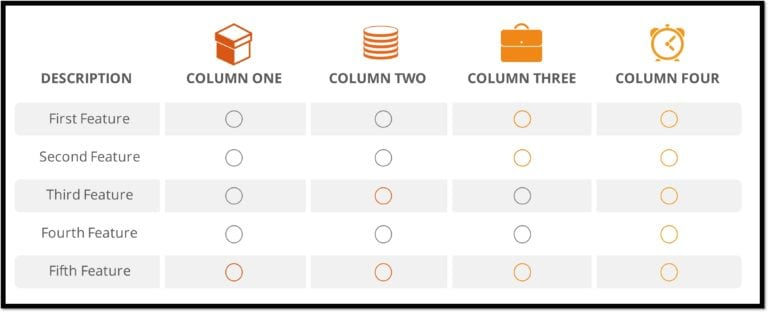

# TỔNG QUAN VỀ SPARK DATAFRAME

Theo Databricks, DataFrame là một tập hợp dữ liệu phân tán được tổ chức thành các cột được đặt tên. Về mặt khái niệm, nó tương đương với một bảng trong cơ sở dữ liệu quan hệ hoặc một khung dữ liệu trong R / Python, nhưng với các tối ưu hóa phong phú hơn. DataFrames có thể được xây dựng từ nhiều nguồn như tệp dữ liệu có cấu trúc, bảng trong Hive, cơ sở dữ liệu bên ngoài hoặc RDD hiện có.

Dataframe thường đề cập đến một cấu trúc dữ liệu, có bản chất là dạng bảng. Nó đại diện cho các Hàng, mỗi hàng bao gồm một số quan sát. Các hàng có thể có nhiều định dạng dữ liệu khác nhau (Không đồng nhất), trong khi một cột có thể có dữ liệu có cùng kiểu dữ liệu (Đồng nhất). Khung dữ liệu thường chứa một số siêu dữ liệu ngoài dữ liệu; ví dụ, tên cột và hàng.

