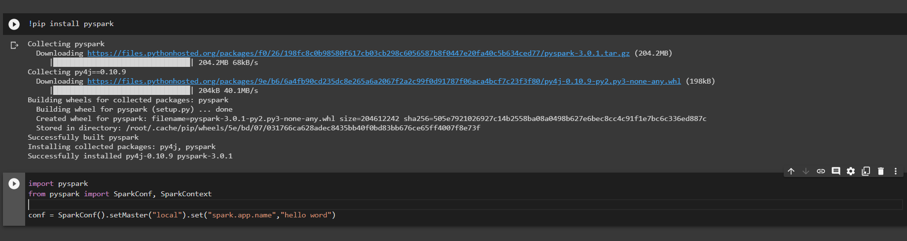

# CÁC THUỘC TÍNH CỦA SPARK *(SPARK PROPERTIES)*

Apache spark cung cấp một bộ giao diện người dùng web tại địa chỉ http://localhost:4040 (Jobs, Stages, Tasks, Storage, Environment, Executors, and SQL). Vào thẻ Environment để xem danh sách các thuộc tính của Spark:

Ngoài ra có thể xác định giá trị mặc định thông qua spark-defaults.conf, SparkConf. Đối với các thuộc tính cấu hình khác, giá trị mặc định sẽ được áp dụng.

## Thuộc tính mặc định có sẳn

Hầu hết các thuộc tính đều có giá trị mặc định hợp lý. Một số thuộc tính như:

### Thuộc tính ứng dụng *(Application Properties)*

Ví dụ:

spark.app.name - Tên ứng dụng của bạn, được hiển thị trong giao diện người dùng và trong dữ liệu nhật ký.

Ngoài ra còn nhiều thuộc tính khác như:

* spark.driver.cores
* spark.driver.memory
* spark.driver.memoryOverhead
* spark.resources.discoveryPlugin,...

### Thuộc tính xáo trộn *(Shuffle Behavior)*

Một vài thuộc tính như:

* spark.reducer.maxSizeInFlight
* spark.reducer.maxReqsInFlight
* spark.reducer.maxBlocksInFlightPerAddress
* spark.shuffle.compress,...

### Giao diện người dùng Spark *(Spark UI)*

Ví dụ:

spark.eventLog.enabled - Có ghi lại các sự kiện Spark hay không, hữu ích trong việc tạo lại giao diện người dùng Web sau khi ứng dụng hoàn tất.

