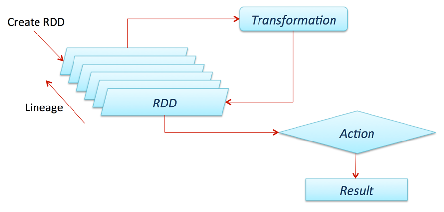

<div align="justify">

# TỔNG QUAN VỀ SPARK RDD *(RESILIENT DISTRIBUTED DATASETS)*

Tập dữ liệu phân tán phục hồi (RDD - Resilient Distributed Datasets) một cấu trúc dữ liệu cơ bản của Spark. Nó là một tập hợp bất biến phân tán của một đối tượng. Mỗi dataset trong RDD được chia ra thành nhiều phần vùng logical. Có thể được tính toán trên các node khác nhau của một cụm máy chủ (cluster).

RDDs có thể chứa bất kỳ kiểu dữ liệu nào của Python, Java, hoặc đối tượng Scala, bao gồm các kiểu dữ liệu do người dùng định nghĩa. Thông thường, RDD chỉ cho phép đọc, phân mục tập hợp của các bản ghi. RDDs có thể được tạo ra qua điều khiển xác định trên dữ liệu trong bộ nhớ hoặc RDDs, RDD là một tập hợp có khả năng chịu lỗi mỗi thành phần có thể được tính toán song song.

Có hai cách để tạo RDDs:
 
Tạo từ một tập hợp dữ liệu có sẵn trong ngôn ngữ sử dụng như Java, Python, Scala.
Lấy từ dataset hệ thống lưu trữ bên ngoài như HDFS, Hbase hoặc các cơ sở dữ liệu quan hệ.

# RDD CREATION

Để tạo RDD, trước tiên cần tạo **SparkSession**, đây là một điểm vào ứng dụng PySpark. SparkSession có thể được tạo bằng cách sử dụng một *builder()* hoặc *newSession()* là các phương thức của **SparkSession**.

**SparkSession** tạo ra một biến sparkContext. Có thể tạo nhiều đối tượng SparkSession nhưng chỉ một SparkContext cho mỗi JVM (Java virtual machine). Trong trường hợp nếu bạn muốn tạo một SparkContext mới khác, bạn nên dừng Sparkcontext hiện có (sử dụng  *stop()*) trước khi tạo một cái mới.

Ví dụ: khởi tạo một ứng dụng có tên *WordCount* với hai luồng như sau

```python
spark = SparkSession.builder()
      .master("local[2]")
      .appName("WordCount")
      .getOrCreate()
```
## Sử dụng parallelize()

SparkContext có một số chức năng để sử dụng với RDD.

Ví dụ: phương thức parallelize() của nó được sử dụng để tạo RDD từ một danh sách.

```python
import pyspark
from pyspark import SparkConf, SparkContext
from pyspark.sql import SparkSession
import collections
# Create RDD from parallelize
spark = SparkSession.builder().master("local[2]").appName("WordCount").getOrCreate()
dataList = [("Java", 20000), ("Python", 100000), ("Scala", 3000)]
rdd = spark.sparkContext.parallelize(dataList)
```

## Sử dụng textFile()

```python
import pyspark
from pyspark import SparkConf, SparkContext
from pyspark.sql import SparkSession
from google.colab import drive
drive.mount('/content/drive')
import collections
# Create RDD from external Data source
spark = SparkSession.builder.master("local[2]").appName("WordCount").getOrCreate()
text_file = spark.sparkContext.textFile("drive/MyDrive/BIGDATA/Week1/exercise2.txt")
```

Sau khi RDD được tạo, bạn có thể thực hiện các hoạt động của tập dữ liệu.
Ví dụ: gán các khoá cho các giá trị có trong tập *dataList*

```python
import pyspark
from pyspark import SparkConf, SparkContext
from pyspark.sql import SparkSession
import collections
spark = SparkSession.builder.master("local[2]").appName("WordCount").getOrCreate()
dataList = ["Java", "Python", "Scala", 'Javascript']
rdd = spark.sparkContext.parallelize(dataList)
key = rdd.map(lambda word: (word, 1))
print(key.collect())

result: [('Java', 1), ('Python', 1), ('Scala', 1), ('Javascript', 1)]
```

Khi bạn có RDD, bạn có thể thực hiện các hoạt động chuyển đổi và hành động. Bất kỳ hoạt động nào bạn thực hiện trên RDD đều chạy song song.

# RDD OPERATIONS

Trên PySpark RDD, bạn có thể thực hiện hai loại hoạt động:

* Các phép biến đổi RDD **(RDD transformations)** - Các phép biến  đổi là các *lazy operations*. Khi bạn chạy một chuyển đổi (ví dụ: cập nhật), thay vì cập nhật một RDD hiện tại, các hoạt động này trả về một RDD khác.

* Các hành động RDD **(RDD actions)** - các hoạt động kích hoạt tính toán và trả về các giá trị RDD cho trình điều khiển.



## Làm việc với các cặp khoá - giá trị *(Working with Key-Value Pairs)*

Spark cung cấp các hoạt động đặc biệt trên RDD có chứa các cặp khóa / giá trị. Các RDD này được gọi là RDD cặp. Cặp RDD là một khối xây dựng hữu ích trong nhiều chương trình, vì chúng thể hiện các hoạt động cho phép bạn thực hiện song song từng khóa hoặc nhóm lại dữ liệu trên toàn mạng.

Ví dụ: cặp RDD có một phương thức reduceByKey() có thể tổng hợp dữ liệu riêng biệt cho từng khóa và một phương thức join() có thể hợp nhất hai RDD với nhau bằng cách nhóm các phần tử có cùng một khóa. Thông thường, trích xuất các trường từ RDD (ví dụ: đại diện cho thời gian sự kiện, ID khách hàng hoặc số nhận dạng khác) và sử dụng các trường đó làm khóa trong các phép toán RDD theo cặp.

Ví dụ 2: Cộng các giá trị trong cặp khoá - giá trị nếu khoá của từng cặp giống nhau
```python
import pyspark
from pyspark import SparkConf, SparkContext
from pyspark.sql import SparkSession
import collections
spark = SparkSession.builder.master("local[2]").appName("WordCount").getOrCreate()
dataList = [("Java", 20000), ("Python", 100000), ("Scala", 3000), ('Java',2300)]
rdd = spark.sparkContext.parallelize(dataList)
counts_test = rdd.reduceByKey(lambda x, y: x + y)
print(counts_test.collect())

result: [('Java', 22300), ('Python', 100000), ('Scala', 3000)]
```

## Phép biến đổi RDD *(RDD Transformations)*

Nhiều phiên bản transformation của RDD có thể hoạt động trên các Structured API, transformation xử lý lazily, tức là chỉ giúp dựng execution plans, dữ liệu chỉ được truy xuất thực sự khi thực hiện action.

Một số RDD Transformations:
* **distinct**: loại bỏ trùng lắp trong RDD
* **filter**: tương đương với việc sử dụng where trong SQL – tìm các record trong RDD xem những phần tử nào thỏa điều kiện. Có thể cung cấp một hàm phức tạp sử dụng để filter các record cần thiết – Như trong Python, ta có thể sử dụng hàm lambda để truyền vào filter
* **map**: thực hiện một công việc nào đó trên toàn bộ RDD. Trong Python sử dụng lambda với từng phần tử để truyền vào map
* **flatMap**: cung cấp một hàm đơn giản hơn hàm map. Yêu cầu output của map phải là một structure có thể lặp và mở rộng được.
* **sortBy**: mô tả một hàm để trích xuất dữ liệu từ các object của RDD và thực hiện sort được từ đó.
* **randomSplit**: nhận một mảng trọng số và tạo một random seed, tách các RDD thành một mảng các RDD có số lượng chia theo trọng số.

## Các hành động RDD *(RDD Actions)*

Action thực thi ngay các transformation đã được thiết lập để thu thập dữ liệu về driver để xử lý hoặc ghi dữ liệu xuống các công cụ lưu trữ.

Một số RDD actions:
* **reduce**: thực hiện hàm reduce trên RDD để thu về 1 giá trị duy nhất
* **count**: đếm số dòng trong RDD
* **countApprox**: phiên bản đếm xấp xỉ của count, nhưng phải cung cấp timeout vì có thể không nhận được kết quả.
* **countByValue**: đếm số giá trị của RDD
    * chỉ sử dụng nếu map kết quả nhỏ vì tất cả dữ liệu sẽ được load lên memory của driver để tính toán.
    * chỉ nên sử dụng trong tình huống số dòng nhỏ và số lượng item khác nhau cũng nhỏ.
* **countApproxDistinct**: đếm xấp xỉ các giá trị khác nhau
* **countByValueApprox**: đếm xấp xỉ các giá trị
* **first**: lấy giá trị đầu tiên của dataset
* **max và min**: lần lượt lấy giá trị lớn nhất và nhỏ nhất của dataset
* **take và các method tương tự**: lấy một lượng giá trị từ trong RDD. take sẽ trước hết scan qua một partition và sử dụng kết quả để dự đoán số lượng partition cần phải lấy thêm để thỏa mãn số lượng lấy.
* **top và takeOrdered**: top sẽ hiệu quả hơn takeOrdered vì top lấy các giá trị đầu tiên được sắp xếp ngầm trong RDD.
* **takeSamples**: lấy một lượng giá trị ngẫu nhiên trong RDD

# MỘT SỐ KỸ THUẬT ĐỐI VỚI SPARK RDD

## Lưu trữ file:

* Thực hiện ghi vào các file plain-text
* Có thể sử dụng các codec nén từ thư viện của Hadoop
* Lưu trữ vào các database bên ngoài yêu cầu ta phải lặp qua tất cả partition của RDD – Công việc được thực hiện ngầm trong các high-level API
* sequenceFile là một flat file chứa các cặp key-value, thường được sử dụng làm định dạng input/output của MapReduce. Spark có thể ghi các sequenceFile bằng các ghi lại các cặp key-value
* Đồng thời, Spark cũng hỗ trợ ghi nhiều định dạng file khác nhau, cho phép define các class, định dạng output, config và compression scheme của Hadoop.

## Caching: Tăng tốc xử lý bằng cache

* Caching với RDD, Dataset hay DataFrame có nguyên lý như nhau.
* Chúng ta có thể lựa chọn cache hay persist một RDD, và mặc định, chỉ xử lý dữ liệu trong bộ nhớ

## Checkpointing: Lưu trữ lại các bước xử lý để phục hồi
 
* Checkpointing lưu RDD vào đĩa cứng để các tiến trình khác để thể sử dụng lại RDD point này làm partition trung gian thay vì tính toán lại RDD từ các nguồn dữ liệu gốc
* Checkpointing cũng tương tự như cache, chỉ khác nhau là lưu trữ vào đĩa cứng và không dùng được trong API của DataFrame
* Cần sử dụng nhiều để tối ưu tính toán.

## Google Colab

<div align="left">Link Google Colab ví dụ: https://colab.research.google.com/drive/1SLXlpPa2qJqnLuiJ5OxNc7dsvRbnEtbM?usp=sharing</div>

# TÀI LIỆU THAM KHẢO

* https://laptrinh.vn/books/apache-spark/page/apache-spark-rdd
* https://helpex.vn/article/rdd-trong-spark-la-gi-va-tai-sao-chung-ta-can-no-5c6afe5bae03f628d053a84c
* https://sparkbyexamples.com/pyspark-tutorial/
* https://www.tutorialspoint.com/apache_spark/apache_spark_rdd.htm
* https://data-flair.training/blogs/spark-rdd-tutorial/
* https://spark.apache.org/docs/latest/rdd-programming-guide.html
* https://ichi.pro/vi/vi-du-ve-viec-su-dung-apache-spark-voi-pyspark-bang-python-267611095265298
* https://laptrinh.vn/link/93#bkmrk-t%E1%BA%A1o-t%E1%BB%AB-m%E1%BB%99t-t%E1%BA%ADp-h%E1%BB%A3p-d
* https://www.oreilly.com/library/view/learning-spark/9781449359034/ch04.html#:~:text=Spark%20provides%20special%20operations%20on,regroup%20data%20across%20the%20network.

</div>
