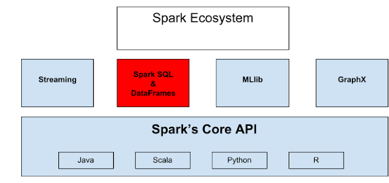

<div align="justify">

# SPARK SQL: GIỚI THIỆU


### Mục tiêu

Apache SparkQuery là một mô-đun Spark để đơn giản hóa việc làm việc với dữ liệu có cấu trúc bằng cách sử dụng các tóm tắt DataFrame và Data set trong Python, Java và  Scala . Những tóm tắt này là tập hợp dữ liệu phân tán được sắp xếp thành các cột được đặt tên. Nó cung cấp một kỹ thuật tối ưu hóa tốt. Sử dụng Spark SQL, chúng ta có thể truy vấn dữ liệu, cả từ bên trong chương trình Spark và từ các công cụ bên ngoài kết nối thông qua các trình kết nối cơ sở dữ liệu tiêu chuẩn (JDBC / ODBC) đến Spark SQL.

Hướng dẫn này bao gồm các thành phần của kiến ​​trúc Spark SQL như DataSets và DataFrames và trình tối ưu hóa Spark SQL Catalyst của Apache. Chúng ta cũng sẽ tìm hiểu việc sử dụng Spark SQL trong Apache Spark, ưu điểm và nhược điểm của Spark SQL.

### Tổng quan Spark SQL

Apache Spark SQL là một mô-đun để xử lý dữ liệu có cấu trúc trong Spark. Sử dụng giao diện được cung cấp bởi Spark SQL, Chúng ta nhận được thêm thông tin về cấu trúc của dữ liệu và các tính toán được thực hiện. Với thông tin bổ sung này, người ta có thể đạt được tối ưu hóa thêm trong Apache Spark. Chúng ta có thể tương tác với Spark SQL theo nhiều cách khác nhau như DataFrame và API bộ dữ liệu . Công cụ thực thi tương tự được sử dụng trong khi tính toán một kết quả, bất kể API / ngôn ngữ nào Chúng ta sử dụng để thể hiện tính toán. Do đó, người dùng có thể dễ dàng chuyển đổi qua lại giữa các API khác nhau.

Trong Apache Spark SQL, chúng ta có thể sử dụng dữ liệu có cấu trúc và bán cấu trúc theo bốn cách:

* Để đơn giản hóa việc làm việc với dữ liệu có cấu trúc, nó cung cấp các tóm tắt DataFrame trong Python, Java và Scala. DataFrame là một tập hợp dữ liệu phân tán được tổ chức thành các cột được đặt tên. Nó cung cấp một kỹ thuật tối ưu hóa tốt.

* Dữ liệu có thể được đọc và ghi trong nhiều định dạng có cấu trúc. Ví dụ: JSON,  Hive  Table và Parquet.
Sử dụng SQL, chúng ta có thể truy vấn dữ liệu, cả từ bên trong chương trình Spark và từ các công cụ bên ngoài. Công cụ bên ngoài kết nối thông qua các trình kết nối cơ sở dữ liệu tiêu chuẩn (JDBC / ODBC) với Spark SQL.

* Cách tốt nhất để sử dụng Spark SQL là bên trong ứng dụng Spark. Điều này cho phép chúng ta tải dữ liệu và truy vấn nó bằng SQL. Đồng thời, chúng ta cũng có thể kết hợp nó với mã chương trình thông thường của NX trong Python, Java hoặc Scala.

* Khi SQL chạy từ ngôn ngữ lập trình khác, kết quả sẽ là Bộ dữ liệu / Khung dữ liệu. Sự tương tác với giao diện SQL được thực hiện bằng cách sử dụng dòng lệnh hoặc qua JDBC / ODBC.

### Dữ liệu trong Spark SQL

Có một số hạn chế với RDD là Khi làm việc với dữ liệu có cấu trúc, không có công cụ tối ưu hóa tích hợp. Trên cơ sở các thuộc tính, nhà phát triển phải tối ưu hóa từng RDD . Ngoài ra, không có quy định để xử lý dữ liệu có cấu trúc. DataFrame trong Spark SQL khắc phục những hạn chế này của RDD. Spark DataFrame là phiên bản Spark 1.3. Nó là một tập hợp phân phối dữ liệu được sắp xếp vào các cột được đặt tên. Khái niệm về Spark Dataframe có ở trong bài học trước - [Spark Dataframe](https://github.com/caoboiloi/Mining-Of-Massive-Datasets/tree/main/Spark%20DataFrame). Chúng ta có thể tạo DataFrame bằng cách sử dụng:

* Tệp dữ liệu có cấu trúc

* Cơ sở dữ liệu bên ngoài

* Sử dụng RDD hiện có

### Bộ dữ liệu Spark SQL

Spark Dataset là một giao diện được thêm vào trong phiên bản Spark 1.6. nó là một bộ sưu tập dữ liệu phân tán. Bộ dữ liệu cung cấp các lợi ích của RDD cùng với các lợi ích của công cụ thực thi được tối ưu hóa của Apache Spark SQL. Ở đây, bộ mã hóa là một khái niệm thực hiện chuyển đổi giữa các đối tượng JVM và các biểu diễn dạng bảng.

Một bộ dữ liệu có thể được tạo bằng các đối tượng JVM và sau đó, nó có thể được xử lý bằng các phép biến đổi chức năng (ánh xạ, bộ lọc, v.v.). API Dataset có thể truy cập inScala và Java. API Dataset không được Python hỗ trợ, nhưng do tính chất động của Python, nhiều lợi ích của API Dataset có sẵn. Trường hợp tương tự với R. Sử dụng Bộ dữ liệu của các hàng chúng ta biểu thị DataFrame trong Scala và Java.

# CÁC LỢI ÍCH, ƯU ĐIỂM VÀ NHƯỢC ĐIỂM TRONG SPARK SQL

### Tối ưu hóa chất xúc tác Spark

Trình tối ưu hóa được Spark SQL sử dụng là trình tối ưu hóa Catalyst. Nó tối ưu hóa tất cả các truy vấn được viết bằng Spark SQL và DataFrame DSL.

Trình tối ưu hóa giúp chúng ta chạy các truy vấn nhanh hơn nhiều so với đối tác RDD của chúng. Điều này làm tăng hiệu suất của hệ thống.

Spark Catalyst là một thư viện được xây dựng như một hệ thống dựa trên quy tắc. Và mỗi quy tắc tập trung vào việc tối ưu hóa cụ thể. Ví dụ: **ConstantFolding** trọng tâm của việc là loại bỏ một  biểu thức không đổi khỏi truy vấn.

### Công dụng của Apache Spark SQL

* Nó thực thi các truy vấn SQL.

* Chúng ta có thể đọc dữ liệu từ các bản cài đặt hiện có bằng SparkQuery.

* Khi chúng ta chạy SQL trong một ngôn ngữ lập trình khác, chúng ta sẽ nhận được kết quả dưới dạng Bộ dữ liệu / Khung dữ liệu (*Dataframe*).

### Các hàm được xác định bởi Spark SQL

* Hàm dựng sẵn: Cung cấp hàm dựng sẵn để xử lý giá trị cột. Chúng ta có thể truy cập hàm inbuilt bằng cách sử dụng lệnh sau:

```python
Import org.apache.spark.sql.functions
```

* Hàm do người dùng xác định (UDF): UDF cho phép bạn tạo các hàm định nghĩa người dùng dựa trên các hàm do người dùng xác định trong Scala.

* Hàm tổng hợp: Chúng hoạt động trên một nhóm hàng và tính một giá trị trả về duy nhất cho mỗi nhóm.

* Windowed Aggregates (Windows): Chúng hoạt động trên một nhóm các hàng và tính toán một giá trị trả về duy nhất cho mỗi hàng trong một nhóm.

### Ưu điểm của Spark SQL

* **Tích hợp**: Apache Spark SQL trộn các truy vấn SQL với các chương trình Spark. Với sự trợ giúp của Spark SQL, chúng ta có thể truy vấn dữ liệu có cấu trúc dưới dạng tập dữ liệu phân tán (RDD). Chúng ta có thể chạy các truy vấn SQL cùng với các thuật toán phân tích phức tạp bằng cách sử dụng thuộc tính tích hợp chặt chẽ của Spark SQL.

* **Truy cập dữ liệu hợp nhất**: Trong Apache Spark SQL, chúng ta có thể chạy các truy vấn Hive chưa sửa đổi trên các kho hiện có. Nó cho phép tương thích hoàn toàn với dữ liệu Hive, truy vấn và UDF hiện có, bằng cách sử dụng giao diện Hive và MetaStore.

* **Kết nối tiêu chuẩn**: Nó có thể kết nối thông qua JDBC hoặc ODBC. Nó bao gồm chế độ máy chủ với kết nối JDBC và ODBC tiêu chuẩn công nghiệp.

* **Khả năng mở rộng**: Để hỗ trợ khả năng chịu lỗi truy vấn giữa và các công việc lớn, cần tận dụng mô hình RDD. Nó sử dụng cùng một công cụ cho các truy vấn tương tác và dài.

* **Tối ưu hóa hiệu suất**: Công cụ tối ưu hóa truy vấn trong Spark SQL chuyển đổi từng truy vấn SQL thành một kế hoạch logic. Hơn nữa, nó chuyển đổi sang nhiều kế hoạch thực hiện vật lý. Trong toàn bộ kế hoạch, nó chọn phương án vật lý tối ưu nhất để thực hiện.

* **Để xử lý hàng loạt các bảng Hive**: Chúng ta có thể sử dụng Spark SQL để xử lý hàng loạt các bảng Hive nhanh chóng.

### Nhược điểm của Spark SQL

* **Loại liên minh không hỗ trợ**: Sử dụng Spark SQL, chúng ta không thể tạo hoặc đọc bảng chứa các trường kết hợp.

* **Không hỗ trợ cho bảng giao dịch**: Giao dịch Hive không được Spark SQL hỗ trợ.

* **Type *Char* không được hỗ trợ**: Type Char không được hỗ trợ. Giống như liên minh, chúng ta không thể đọc hoặc tạo bảng với các trường như vậy.

* **Không có lỗi cho quá khổ của Type *Varchar***: Ngay cả khi giá trị được chèn vượt quá giới hạn kích thước, sẽ không có lỗi xảy ra. Dữ liệu tương tự sẽ bị cắt bớt nếu đọc từ Hive nhưng không được đọc từ Spark. SparkQuery sẽ coi varchar là một chuỗi, có nghĩa là không có giới hạn kích thước.

# TÀI LIỆU THAM KHẢO

* https://helpex.vn/article/spark-sql-huong-dan-gioi-thieu-5c6b25a6ae03f628d053c3e8#:~:text=Apache%20Spark%20SQL%20l%C3%A0%20m%E1%BB%99t,h%C3%B3a%20th%C3%AAm%20trong%20Apache%20Spark.
* https://spark.apache.org/docs/latest/api/sql/index.html
* https://streamsets.com/documentation/transformer/3.11.x/help/transformer/Processors/SparkSQLQuery.html
</div>