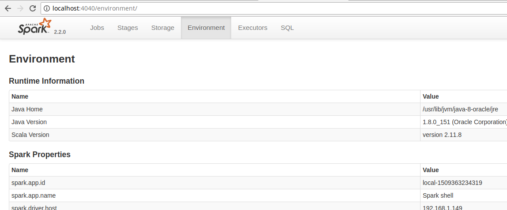

# CÁC THUỘC TÍNH CỦA SPARK (SPARK PROPERTIES)

Apache spark cung cấp một bộ giao diện người dùng web tại địa chỉ http://<driver>:4040 (Jobs, Stages, Tasks, Storage, Environment, Executors, and SQL). Vào thẻ Environment để xem danh sách các thuộc tính của Spark.

